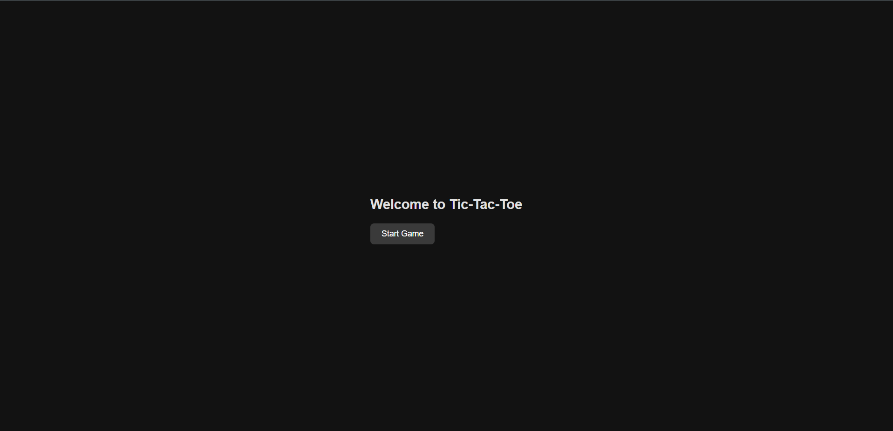
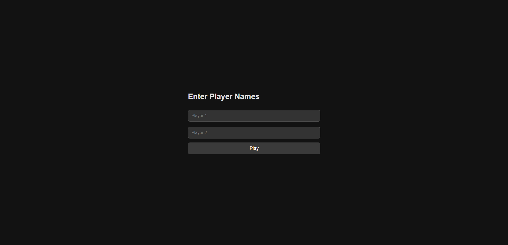
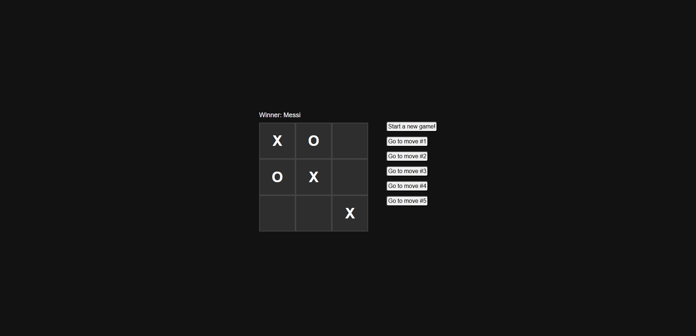

# Tic-Tac-Toe Game

This Tic-Tac-Toe game is a fun, classic game built for two players, designed as a portfolio project. The app includes a home page to start the game, a player input page to add player names, and an interactive game board.

## Features

- **Home Page:**
  - Start the game with a single click.
- **Player Input Page:**

  - Enter player names for a personalized experience.

- **Game Board:**
  - Interactive grid for gameplay.
  - Displays the winner or declares a tie after each game.

## Pages

1. **Home Page (`/`):**

   - Contains a "Start Game" button that navigates to the player input page.

2. **Player Input Page (`/add_players`):**

   - Form to enter two player names before starting the game.

3. **Game Page (`/game`):**
   - Displays the Tic-Tac-Toe board and tracks the players' moves.
   - Declares a winner or a tie when the game ends.

## Tech Stack

- **Frontend:** React
- **Deployment:** Netlify

## Installation

1. Clone the repository:

   ```bash
   git clone https://github.com/Imtiaz4530/tic_tac_toe
   ```

2. Install dependencies (if using React or similar):

   ```bash
   yarn
   ```

3. Run the application locally:

   ```bash
   yarn dev
   ```

4. Open the browser and navigate to `http://localhost:5173` (or specified port).

## Screenshots

### Home Page



### Player Input Page



### Game Board



## Contributing

Contributions are welcome! Open an issue or submit a pull request to improve the Tic-Tac-Toe app.
